

# 🛡️ SOP Control

### 让 Agent 在规则之外保持自主，在规则之内保持忠实
**低开销 · 模型中立 · 活在项目里的本地控制平面与可审计记忆**

  
  
  
  
  
  

**中文首页** · [English](#english) · [中文独立版](README_ZH-CN.md)

  

> [!NOTE]
> **SOP Control 是一个低开销、模型中立、活在项目里的本地控制平面。**
>
> 它的任务不是替 Agent 思考，也不是替业务产品做语义判断，而是把已经确定的规则、用户希望长期保留的动态 SOP，以及默认最自然经济的执行逻辑，变成跨会话、跨模型、可观察、可验证的项目边界。

**一句话理解：** 让 Agent 在规则之外保持自主，在规则之内保持忠实。

**再一句话（给长期重度用户）：** SOP Control 是 Agent 的**可审计记忆**——你随口纠正的每一条经验，带着哪句话来的、谁确认的、适用什么范围、现在第几版，永久保存、换模型不丢、升级不丢；没确认的东西，永远只是建议。

**当前状态：** v0.4.0 · **Beta / early public**。适合细分产品接入、评估和狗粮测试；还不宣称是操作系统级沙箱、企业合规平台或对抗恶意进程的安全边界。请同时阅读 [LIMITATIONS.md](LIMITATIONS.md)、[RESIDUAL_RISKS.md](RESIDUAL_RISKS.md) 和 [CHANGELOG.md](CHANGELOG.md)。

---

## ⚡ 5 分钟上手：先亲眼看它拦住 Agent

**60 秒演示**（不需要模型、不需要 API key，只在临时目录里运行）：

~~~bash
git clone https://github.com/mixxmax/sopcontrol.git && cd sopcontrol
python3 -m venv .venv && source .venv/bin/activate
pip install -e .
scripts/demo.sh            # 英文旁白：scripts/demo.sh --en
~~~

脚本把 Claude Code 调用工具时发给钩子的真实请求逐个交给 `sopctl`，打印它的真实决定：

| Agent 想做的事 | SOP Control |
| :--- | :--- |
| 正常修改业务代码 | ✅ 放行 |
| 你说了「先讨论，不要修改代码」，它还是要写文件（Write/Edit 或 Bash 都一样） | ⛔ 拒绝，直到你说「可以改了」；只读命令照常可用 |
| 自己执行 `sopctl intent clear` 把讨论锁解开 | ⛔ 拒绝（讨论锁只能由人设置或解除） |
| `git push --no-verify` 绕过推送前检查 | ⛔ 拒绝 |
| 删掉 `.git/hooks/pre-push`，或用 `git -c core.hooksPath=… push` 跳过它 | ⛔ 拒绝 |
| 直接改 `.sopcontrol/` 里的规则文件，给自己放宽限制 | ⛔ 拒绝（规则只能经 `sopctl` 命令变更） |
| 改 `.claude/settings.json`，卸掉拦截钩子 | ⛔ 拒绝（卸载属于提权，需要人来做） |

**接到你自己的项目（Claude Code）：**

~~~bash
pip install "git+https://github.com/mixxmax/sopcontrol.git@v0.4.0"
cd /path/to/your-repo
sopctl init .           # 在项目里建立 .sopcontrol/（规则与证据账本，随仓库走）
sopctl hook claude .    # Claude Code 每次调用工具前先经过 sopctl 判定
sopctl hook install .   # git push 前自动运行 sopctl gate
~~~

用 OpenCode 时把第三行换成 `sopctl hook opencode .`。之后写你自己的规则、记录长期偏好，见下方[十、快速开始](#十快速开始)。

> 如实说明：
> - 「只讨论」锁目前由你在终端执行 `sopctl intake . --conversation <对话摘录文件>` 设置，Claude Code 里还不会自动从你的消息中识别；
> - 写到任务范围之外的文件，是在 `sopctl task submit` 时被拒绝，而不是写入的那一刻。
>
> 它约束的是合作的 Agent，不是沙箱，详见 [LIMITATIONS.md](LIMITATIONS.md)。

---

## 一、它要解决的根本问题

一个协作中的大模型经常不是“不会做”，而是会在不该重新思考的地方重新思考：

- 用户已经确定的决定只停留在聊天记录里，换会话或换模型后被重新解释；
- Agent 把已经约定的产品规则当成建议，擅自改变入口、顺序、写入边界或完成标准；
- 用户临时说出一个看似细小、实际希望长期保留的要求，后来既没有进入产品文档，也没有进入控制系统；
- 为了完成一个目标，Agent 先做昂贵的大范围工作，最后才发现其中大部分不需要处理；
- 工具报告“已完成”，但实际上没有经过产品要求的检查，或者没有真的到达受控入口；
- 每个宿主产品都要为每个模型重新写一套提示词和接入逻辑。

SOP Control 把这些问题拆成两个空间：

| 空间 | 谁负责 | 允许发生什么 |
| :--- | :--- | :--- |
| **规则空间** | 项目、产品和用户 | 决定什么不能被悄悄重开，哪些检查必须发生，哪些范围允许变化 |
| **解法空间** | Agent 和宿主产品 | 在规则允许的范围内选择实现方案、调用顺序和具体表达 |

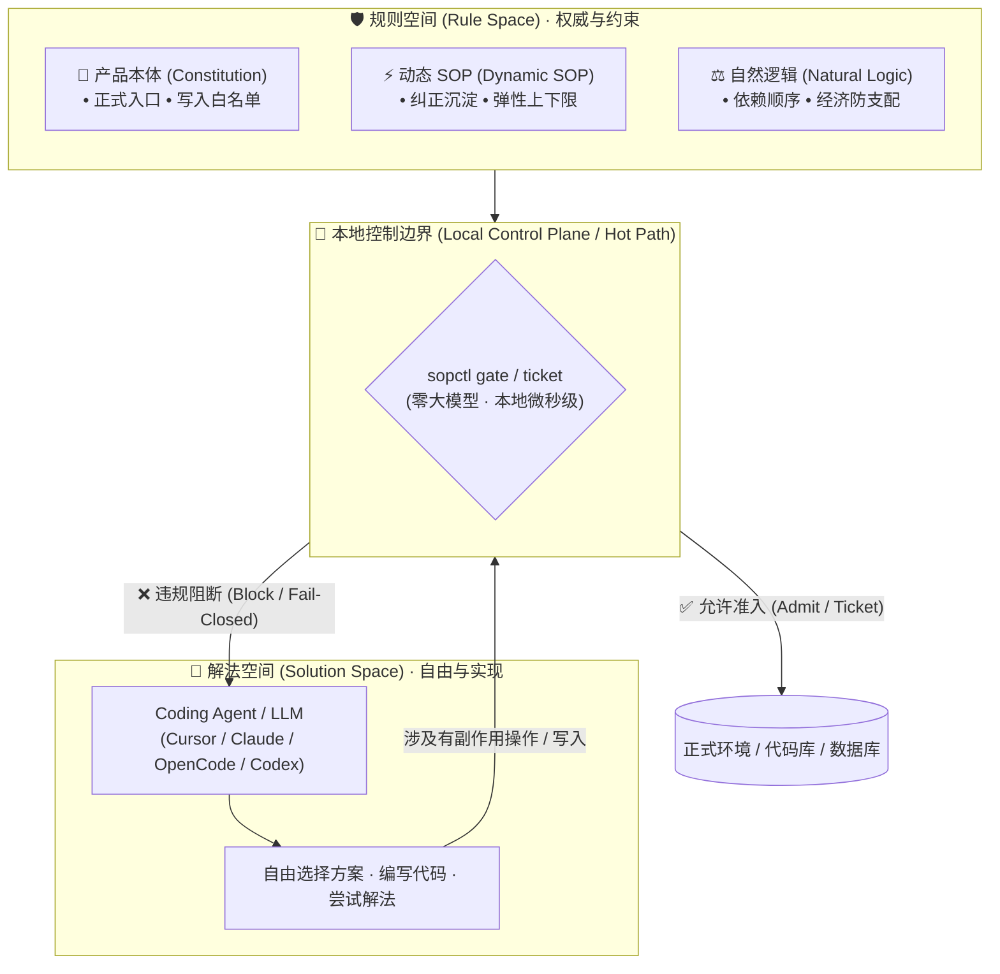

核心原则是：

> **自主性应当存在于解法空间，而不是规则空间。**

这不意味着把 Agent 变成僵硬脚本。它意味着把“是否遵守已定规则”和“如何在规则内完成任务”分开；模型可以灵活解决问题，但不能用灵活解法重新打开已经决定的约束。

### 用户常见痛点 → 我们怎么解

| 你可能遇到的情况 | 没有控制面时通常会怎样 | SOP Control 对应做法 |
| :--- | :--- | :--- |
| **换会话 / 换模型后，上周说好的约定又被重开** | 约定只在聊天里，新模型当成建议重新争论 | 写入 `.sopcontrol/` 权威规则并投影到 Agent 上下文；换模型 `rebind` 只收紧不放宽 |
| **明明说了“只能改这些文件 / 必须走正式入口”，Agent 还是改到别处** | 靠提示词约束，发现时文件已经动了 | 任务契约 `allowed_writes` + hook / harness / gate 在动作边界拦截 |
| **工作中随口纠正了一句，希望以后都这样，结果下次又忘了** | 纠正留在某一通对话里，进不了产品和控制系统 | 动态观察 / `learn` 生成提案；**你确认后**才进入永久动态 SOP |
| **想“只这次例外”，却被写进长期规则；或反过来，长期偏好被当成一次性闲聊** | 没有 once_only / permanent 分流 | `once_only` 不进永久 registry；长期保留必须显式确认 |
| **Agent 先对一大堆对象做昂贵处理，最后才发现大半不该做** | 默认计划浪费调用和等待 | 自然逻辑约束默认顺序（先过滤再昂贵步骤）；你明确要求反向时记为本次例外 |
| **工具说“完成了”，但其实没走过产品检查，或只是模型自报** | 把声明当成成功 | 活动日志区分 verified / observed / declared / unproven；gate allow ≠ 工具已执行成功 |
| **每个模型、每个宿主都要重写一套提示词和接入** | 规则散落在各处，换栈就失效 | 同一项目控制面 + 多 harness 适配；宿主（如 JobsFlow）可 vendored 同一 pin |
| **装了很多“Agent 相关”工具，仍说不清规则有没有真的生效** | 提示词、编排、可观测性各管一段，没有动作边界证据 | `sopctl gate` / `log report` / coverage：报告哪些入口被控、哪些仍是 gap |
| **担心控制面会不会每一步都多打一轮大模型、又贵又慢** | 再雇一个审查 Agent，或把所有检查塞进 prompt | **热路径默认零额外 LLM**；审查与 Distiller 只在冷路径/可选升级 |
| **想要安全合规级沙箱，或自动替业务判断对错** | 期望控制面做 EDR / 内容审核 / 业务语义引擎 | 明确不做：我们管规则边界与证明；业务语义与对抗恶意进程不在 Beta 承诺内 |

---

## 一附、我们是什么 · 干什么 · 干不了什么

| | 说明 |
| :--- | :--- |
| **我们是什么** | 活在项目仓库里的**本地控制平面**：把已定规则变成跨会话、跨模型仍有效的边界，并留下可检查的证据。 |
| **我们干什么** | 固定正式入口与写边界；拦截未授权动作；区分“观察 / 提案 / 永久规则”；约束默认经济执行顺序；报告哪些环节被控、哪些只是自报。 |
| **我们不干什么** | 不替 Agent 写业务代码或做 JD/事实语义判断；不替代测试与代码评审；不把聊天当永久权威；不当操作系统沙箱或企业 DLP；不保证模型永不犯错。 |

**一句话：** SOP Control 管“规则有没有被遵守、有没有被证明”；宿主产品和 Agent 管“业务内容对不对、写得好不好”。

---

## 一附 B、什么时候你不需要 SOP Control

很多“和 Agent 相关”的做法看起来像 SOP Control，但解决的是另一类问题。先对照下表排除，避免装错工具——下面不点名任何产品，只按“你要解决的事”划分。

| 如果你要解决的是 | 通常做法 | 为什么那不是 SOP Control |
| :--- | :--- | :--- |
| 让模型“多听你几句”，把偏好塞进上下文 | 自定义指令、项目提示词文件 | 那是建议，不是权威。我们把权威放进 `.sopcontrol/`，并用 hook / gate / ticket **在动作边界拦截**；投影文件只是给 Agent 看的摘要，不是第二套权威源。 |
| 拆任务、调工具、走流程图 | 多 Agent 编排 | 我们不编排业务图。编排回答“下一步调谁”；我们回答“这一步有没有资格发生”。 |
| 拦截有害、越权、敏感输出 | 内容审核与 guardrails | 我们管的是**项目 SOP 与产品入口**，不是通用内容审核。两者可并存：一个管说了什么危险话，一个管有没有绕过产品写入口。 |
| 看见调用链、token、延迟、失败 | 可观测性与 trace | 我们提供活动日志与覆盖报告，但目标是**控制证据**（gated / admitted / verified / unproven），不是通用 APM。日志不能放行，也不能把自报写成成功。 |
| 对抗恶意软件、数据外泄、未授权进程 | 企业策略 / 沙箱 | 威胁模型不同：我们面向**协作中的本机操作者与 coding agent**，不宣称挡住拥有同等文件系统权限、刻意绕过全部入口的恶意进程。 |
| 每次改动都想被再看一遍 | 外加审查环节 | 我们默认**热路径零额外模型调用**；审查是高风险升级，不是每次编辑的税。 |

**我们独有的三件事**（上面几类做法都不提供）：

| 🧠 **可审计的记忆** | 🔒 **确认才生效** | 🛡️ **升级不丢规则** |
| :--- | :--- | :--- |
| 每条永久规则都带着哪句原话来的、谁确认的、适用什么范围、现在第几版——**50 条规则、三个模型、两次升级之后，你仍然敢删其中一条**。 | 一次点击都不会被当成确认；调用方自称用户也不算；**没确认的内容永远只是建议**。 | 版本化运行时 + 语义 diff + 影子验证；**目标版本若丢规则或放宽控制，立即阻断切换**。 |

**一句话选型：** 只想让模型听话一点 → 上面做法往往够用；想要**定下的规则在换模型、换会话、升版本之后仍然有效，且能证明** → 用 SOP Control。

---

## 一附 C、哪里会调用大模型（默认几乎不调用）

> [!TIP]
> **核心结论：SOP Control 本体的热路径不调用大模型。** 仓库内没有内嵌 OpenAI / Anthropic 等 SDK 作为默认依赖；规则选择、gate、票据、账本、活动日志都是本地确定性逻辑。

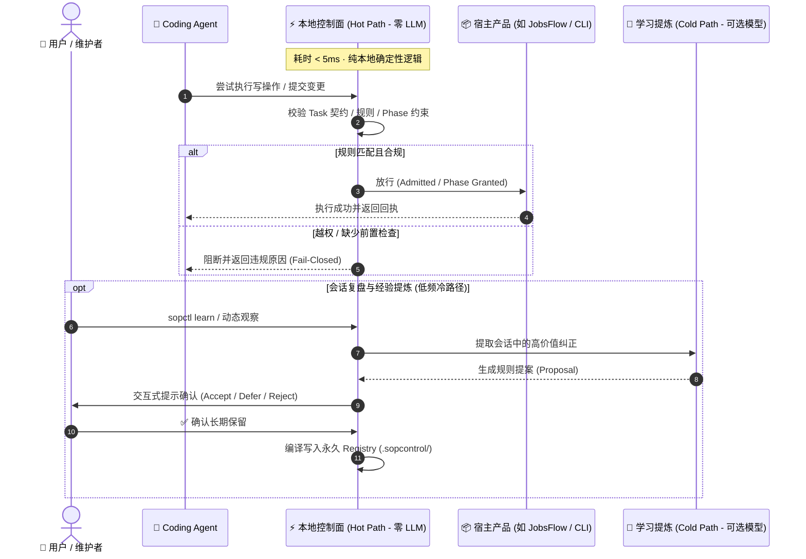

| 路径 | 是否调用 LLM | 说明 |
| :--- | :--- | :--- |
| `gate` / `doctor` / `audit` / 规则选择 / 冲突与成本支配判断 | **否** | 本地纯函数或本地 I/O |
| hook / harness 拦截、capability ticket challenge·redeem | **否** | 本地控制面 |
| `sopctl log *` 活动日志写入与报告 | **否** | 明确零 LLM |
| 动态观察、确定性提案提炼（默认 Distiller） | **否** | `DeterministicRuleExtractor` 只做主题/信号规则，不伪装成 LLM |
| 可选 Distiller Adapter（学习冷路径） | **可选，默认未接通** | 仅用于把有界证据包提炼成**提案**；每个学习窗口默认最多 1 次；**不能**写 registry、不能伪造用户确认、不能放行当前动作。本仓库提供的真模型位是 `UnprovenLLMAdapter`（标明未接通，不假装可用） |
| `repair` 语义修复 | **间接** | 脊柱不内嵌 LLM；若配置外部 harness CLI（如 OpenCode），由**外部 Agent**执行修复，SOP Control 只约束范围与回执 |
| 宿主产品（如 JobsFlow）写简历、评 JD、对话 | **由宿主决定** | 那是宿主业务模型调用；SOP Control 只要求正式入口、检查是否发生、结果是否影响下一步，**不替宿主做业务语义判断** |

因此：

- 装上 SOP Control **不会**让每个工具调用都多打一轮模型；
- 你日常看到的模型调用，通常来自 **Cursor / Claude / Codex / JobsFlow 自己**，不是来自控制面热路径；
- 若你自行接入 LLM Distiller，它也只出现在低频学习提案路径，并且仍须用户确认后才能成为永久规则。

---

## 二、三类平级、长期存在的产品规则

SOP Control 的完整规则空间由三类规则共同构成。它们是平级的、可长期存在的不同来源，不是“硬规则、软规则、临时规则”的上下级替代关系。它们的差别在于来源、作用范围和激活条件，而不在于谁更像真正的规则。

| 规则类型 | 它记录什么 | 典型来源 | 在运行中负责什么 |
| :--- | :--- | :--- | :--- |
| **产品本体 / Constitution** | 产品逐步形成的事实、边界、入口、状态机、交付条件和不可违反的设计决定 | 产品设计、代码结构、已确认的系统决策 | 固定产品应该如何运行 |
| **动态 SOP** | 用户在工作过程中不经意说出、但希望以后仍然保留的细致要求，以及允许模型发挥的幅度 | 对话纠正、操作复盘、显式学习 | 固定这次经验应如何长期影响后续运行 |
| **自然逻辑 / Natural Logic** | 在没有特别反向要求时，最自然、最短、最省调用、最少重复劳动且最符合目标的默认顺序 | 任务目标、依赖关系、成本与前置条件 | 防止模型走明显支配浪费的路径 |

### 2.1 产品本体规则

这是随着产品建设逐渐形成的“产品宪法”，例如：

- 哪些入口是正式入口，哪些旁路必须阻断；
- 哪些数据或材料只能由产品自己的受控入口写入；
- 哪些状态必须先完成，后续动作才有资格开始；
- 哪些检查是产品定义的一部分，结果必须被后续动作消费；
- 什么算任务完成，什么只能算观察到或自报完成。

它通常由产品负责人或维护者明确写入，并通过真实消费者、hook、harness、CI 或 gate 接线。项目中的权威源在 .sopcontrol/；AGENTS.md 和 CLAUDE.md 是给 Agent 使用的投影，不是另一个可以互相冲突的规则库。

### 2.2 动态 SOP 规则

动态 SOP 解决的是一个很典型的长期问题：

> 用户没有在产品宪法里预先写下某条细节，但在实际工作中明确表达了一个以后仍然希望遵守的标准。

例如：“独立审计只检查是否贴合 JD、是否有明显事实错误和是否完成指定的 LLMO；不要自行扩展成全方位挑错，也不要为了消除一个可解释的轻微夸大而反复重写。”

这类规则必须能表达：

- 何时触发、适用于哪个任务或动作；
- 必须检查什么，以及明确不检查什么；
- 模型可以自由发挥的范围；
- 允许幅度的上限和下限；
- 发现问题时的修正策略、最大轮数和停止条件；
- 哪些变化属于一次性例外，哪些变化应长期保留。

动态 SOP 的“动态”指来源和适用范围可以随项目实践形成，不指它会自动过期。只要用户选择长期保留，它就与产品本体规则一样进入永久规则空间；不会因为一段时间未使用、重启、换模型、升级软件或上下文窗口结束而消失。只有用户明确选择 once_only 的会话约束、任务契约、能力票据和运行证据才属于可过期对象。

### 2.3 自然逻辑规则

自然逻辑不是替用户发明业务目标，也不是禁止用户选择反直觉方案。它只提供一个默认问题：

> 在用户没有指定反向目的时，哪条路径最少做无用工作，同时仍然满足任务目标和产品前置条件？

JobsFlow 的典型例子是：

1. 先筛出时间范围和职位条件符合的岗位；
2. 再排除已经入表的岗位；
3. 只对剩余岗位评分；
4. 最后展示或写入结果。

“先把所有岗位都评分，再看哪些未入表”通常是被前一种计划支配的浪费。SOP Control 可以通过目标、操作契约、依赖和本地成本判定识别这种顺序问题；但如果用户明确要求反向实验或全量评分，系统应记录为本次例外并执行，而不是擅自把用户纠正回默认逻辑。

---

## 三、规则如何进入控制系统

SOP Control 不把所有对话自动变成规则，也不要求用户每次都手工写规则。它提供并存的几条入口，每条入口都明确区分“发现”“提案”和“获得权威”。

### 3.1 产品本体：明确写入

适合已经确定、应成为产品长期设计的规则：

~~~bash
sopctl rule add --id RULE-001 \
  --statement "Data mutations must go through unified preview_gate" \
  --modality MUST --status proposed \
  --source-ref README.md --consumer-marker preview_gate

sopctl rule accept RULE-001 .
sopctl project all .
~~~

实际使用中，规则可以来自产品文档、架构决策或经过验证的代码行为；但“模型推测它应该是规则”不能直接成为权威。写入后需要有真实消费者或测试证明它不是只存在于 registry 里的文字。

### 3.2 无感观察：自动发现动态候选

日常对话和运行事件可以被低打扰地观察：

1. 收集用户纠正、反复强调、异常后的明确操作方向和任务上下文；
2. 用本地规则做去重、范围隔离和低价值过滤；
3. 只生成候选，不写入永久 registry；
4. 在候选稳定、影响明确且值得长期保存时，以简短提示询问用户。

自动识别的目标是“不让用户忘掉重要经验”，不是替用户做永久决策。闲聊、错误堆栈、一次性实验和模型自我辩护不应因为出现了关键词就成为规则。

### 3.3 显式 learn：借鉴 Antigravity 的明确学习入口

Antigravity 的 /learn 提供了一个很有价值的产品启发：用户可以在需要时要求 Agent 回顾当前上下文，把经验提炼成可复用的规则或技能。SOP Control 将这个入口纳入控制面，但不把它等同于直接写入宿主的 AGENTS.md：

~~~bash
sopctl learn review . --task-id <task-id>
sopctl learn list .
sopctl learn show <proposal-id> .
sopctl learn decide <proposal-id> --decision control .
~~~

learn 的完整链路是：

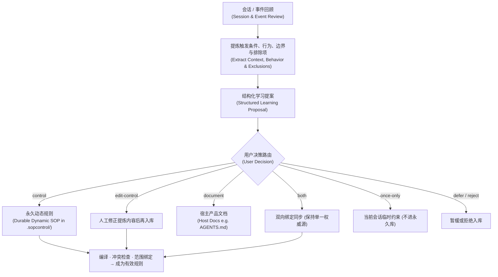

其中：

- control：把规则作为动态 SOP 纳入 .sopcontrol/ 的永久权威空间；
- edit-control：先修改提炼结果，再纳入控制空间；
- document：写入宿主产品自己的文档体系，例如 AGENTS.md，由产品决定如何使用；
- both：控制面和产品文档各保留一份，但必须有清楚的来源关系，不能形成两个独立权威；
- once-only：只服务于当前任务或会话，绝不进入永久 registry；
- defer / reject：保留审阅结果，但不改变有效规则。

模型可以帮助总结、归纳和提出候选，但模型输出、候选记录、日志和“模型说已确认”都不等于授权。永久规则必须有真实的用户确认，并经过编译和运行接线。

因此，产品体验可以同时成立：

- 默认情况下，SOP Control 无感观察，必要时只弹出一条短确认；
- 用户想主动沉淀经验时，可以显式使用 learn；
- 用户仍可把产品说明写进自己的 AGENTS.md，SOP Control 不强行接管产品文档；
- 只有用户选择进入控制面的内容，才获得跨会话、跨模型的控制效力。

### 3.4 任务级约束：明确是临时还是长期

任务契约、当前 run 的参数和一次性票据适合描述“这次怎么做”。它们可以收紧当前任务，但不应伪装成永久产品规则。任务完成、票据消费或会话结束后，它们可以失效；如果用户希望经验长期保留，应通过动态 SOP 或 learn 重新进入永久空间。

### 3.5 自然逻辑：默认生成，显式反向可覆盖

自然逻辑通常不需要用户为每个普通顺序写一条规则。宿主提供任务目标、操作依赖、已处理集合、成本信息和允许的例外，SOP Control 就可以生成或校验默认计划。

默认计划只在没有反向意图时生效。用户明确要求“这次先全量评分再过滤”时，系统应把它看作当前任务的显式例外，而不是把自然逻辑升级成不可违反的业务法。

---

## 四、从候选到有效规则的完整闭环

无论候选来自自动观察还是 learn，都必须经过同一条权威链：

```mermaid
stateDiagram-v2
    direction LR
    [*] --> 观察: 对话纠正 / 操作复盘
    观察 --> 提案: 自动提取候选 (无权威)
    提案 --> 用户选择: 显式确认 (拒绝/修改/采纳)
    用户选择 --> 弹性编译: 规则分类 / 范围绑定
    弹性编译 --> 语义检查: 冲突 / 放宽 / 过期防御
    语义检查 --> 投影生效: 投影至 Agent 上下文
    投影生效 --> 运行拦截: Gate / Harness / Hook 动作拦截
    运行拦截 --> 证据审计: 活动日志 / 账本验证
    证据审计 --> [*]
```

一条合格的动态规则不应只有一句口号。至少要能回答：

- 什么时候适用；
- 对哪个产品、任务、动作和对象适用；
- 目标是什么；
- 必须做什么；
- 明确不要求什么；
- 允许模型怎么变通；
- 超出幅度时是停止、修正一次、请求确认还是继续；
- 怎样证明它真的接到了运行入口。

规则“存在于 registry”不等于规则“正在控制”。有效性至少需要编译状态、投影状态、消费者或测试证据；运行报告还要区分已验证、已观察、自报和未知。

---

## 五、运行时控制：低开销而不是高仪式

SOP Control 的效率目标是：把确定性工作留给本地控制面，把模型调用留给确实需要理解的冷路径。

| 路径 | 默认行为 |
| :--- | :--- |
| 规则选择、范围匹配、状态机、冲突和成本支配判断 | 本地确定性执行，热路径不调用 LLM |
| 只读查询和计划预览 | 尽量直接通过 gate，默认不发能力票据 |
| 写入、发布、外部提交等有副作用动作 | 在产品正式入口执行，按风险进行 admit / ticket / receipt |
| 同一阶段的多个受控动作 | 尽量使用一个 phase grant，避免每一步重复取票 |
| 复杂经验归纳、动态规则提炼 | 低频冷路径；可选模型只生成提案 |
| 必须由宿主完成的语义检查 | SOP 确保检查被调用、结果被消费并影响下一步，不替宿主判断业务内容 |

票据、账本、哈希和日志的意义不是把每个普通动作都变成审批流程，而是让高影响动作有可解释的准入和回执。只读路径不应因为控制面存在而被迫进行多轮确认。日志是运行可见性，不是第二套规则；它不能放行动作，也不能凭自己把经验写入永久空间。

---

## 六、接入：一次连接，持续覆盖

SOP Control 的另一个终极母题是对接：安装一次后，尽量不用用户逐个改造产品入口，也不让控制面和宿主产品互相打架。

### 6.1 首次接入做什么

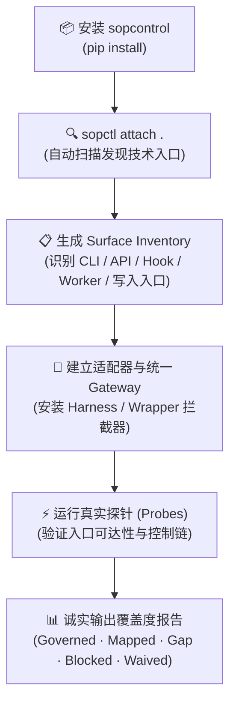

attach 的自动发现会读取宿主的有限结构信息和入口元数据，目的是建立“产品有哪些可被控制的表面”；它不是把整个产品全文塞给模型，也不是未经确认改写业务逻辑。对可以安全接入的入口，系统建立适配器、投影和探针；对暂时无法接入的入口，必须诚实报告 gap 或 blocked，不能把未发现当成已覆盖。

“一次接入”不等于任何产品都可以零改造。宿主至少要有可识别、可包装或可适配的正式入口；如果所有行为都在不可观察的旁路中，控制面无法凭空制造控制点。产品化目标是让用户只面对一个安装/attach/verify 接口，让适配工作集中在 SOP Control 的 adapter 契约和宿主的薄 gateway，而不是让用户为每个动作手工调试。

### 6.2 控制成功率与覆盖率

“装上了”不是“发挥了作用”。SOP Control 应按宿主实际可枚举的执行单元统计：

- discovered：发现了入口；
- mapped：已映射到控制面动作；
- probed：真实探针证明入口可达；
- governed：运行时确实经过 gate / harness / hook；
- waived：明确豁免且有理由；
- blocked / gap：不能证明控制或发现了缺口；
- unknown：没有足够的宿主证据。

在工作流型产品中，执行单元可以是 scan、filter、score、write、render、apply 等固化阶段；在非工作流产品中，应以可枚举的命令、API、worker 和副作用入口作为测算依据。控制成功率只能按“有证据的 eligible units”计算；分母未知时必须显示 unknown 或 partial，不能显示虚假的 100%。

### 6.3 升级和回滚

宿主产品内嵌的是一个版本快照，因此 SOP Control 更新后不会神奇地改变另一仓库里已经 vendored 的副本。理想的用户体验是宿主只执行一条更新路径：

~~~bash
sopctl sync .
sopctl rollback .
~~~

升级流程应完成版本绑定、兼容性检查、动态 SOP 保留检查、语义 diff、影子验证、原子切换和失败回滚。JobsFlow 这类宿主通过 vendor pin、manifest 或依赖版本把快照钉住；更新时由宿主拉取并验证新的 SOP Control，而不是让用户手工复制一堆文件。若升级导致规则丢失、控制范围放宽或适配器断开，应保持旧版本，不应静默切换。

---

## 七、运行日志：让不可见的控制变得可检查

SOP Control 是可视化程度不高的基础设施，所以必须留下足够小、足够安全、能解释实际作用的运行日志。日志回答的不是“模型说它做了什么”，而是：

- 任务和动作是什么；
- 选择了哪些规则；
- 哪个入口经过了哪个 gate；
- 是否需要票据、是否成功兑换；
- 宿主是否真正启动、完成和回传；
- 必需的业务检查是否被调用、结果是否被消费；
- 哪些环节被控制、哪些只是被观察、哪些仍未知；
- 哪些运行经验形成了学习候选。

常用命令：

~~~bash
sopctl log list .
sopctl log show . --run-id <run-id>
sopctl log report . --run-id <run-id> --format markdown
sopctl log health .
sopctl log benchmark .
~~~

日志放在 .sopcontrol-local/，不进 Git，不作为永久规则源，也不保存 ticket secret 或完整 prompt。运行报告应明确区分：

- verified：有可信运行时证据；
- observed：观察到事件，但没有足够的执行证明；
- declared：调用方自报；
- unknown：无法判断。

日志可以成为后续学习窗口的输入，但不会自动批准动态 SOP，也不会把失败报告变成成功。

---

## 八、宿主产品中的典型表现：JobsFlow

[JobsFlow](https://github.com/mixxmax/jobsflow) 是一个嵌入示例。它把 SOP Control vendored 到产品中，让 scan、push、materials、apply 和 learn 共享同一个控制面和统一 gateway。

在 JobsFlow 中，职责应这样分开：

| 事项 | JobsFlow 负责 | SOP Control 负责 |
| :--- | :--- | :--- |
| 抓取 JD、生成材料、事实与业务语义 | 实现和判断内容 | 不替代 |
| 是否必须做 JD 贴合、事实和 LLMO 检查 | 定义检查本身 | 确保检查入口被调用、结果影响后续动作 |
| 先筛选、再排除已入表、再评分 | 提供业务对象和阶段 | 约束默认计划，阻止明显支配浪费 |
| 哪些动作能写数据库、提交材料或申请 | 提供正式写入口 | 确保动作不能绕过入口 |
| 动态 SOP 和显式 learn | 提供业务上下文 | 管候选、确认、永久保存、激活和证据 |
| 版本升级 | 更新 vendor pin / manifest | 检查兼容、保留规则并支持回滚 |

例如用户说“检索过去一周的 paralegal 岗位，展示尚未入表的评分”，正常默认路径应是筛选、排除、再评分，而不是先对所有岗位评分再过滤。用户如果明确要求一次反向实验，可以覆盖该默认，但这应是清楚的任务例外。

JobsFlow 的业务结果仍由 JobsFlow 自己负责。SOP Control 的价值是让产品已经设计好的入口、顺序、检查和状态真正成为 Agent 必须经过的控制边界，而不是把业务语义搬进控制面。

---

## 九、用户实际会看到什么

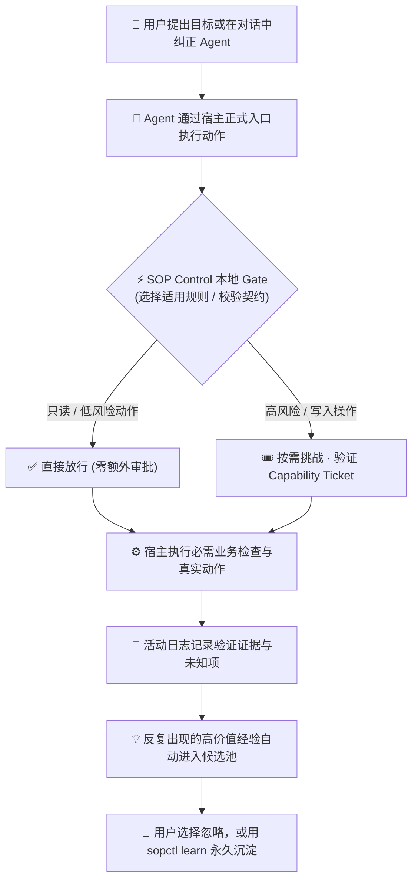

理想的日常体验不是“每一步都弹窗”，而是：

1. 用户正常说话，系统在后台观察；
2. 普通低风险路径没有多余票据和审批；
3. 规则冲突、缺少前置条件或真实入口不明时，给出具体下一步；
4. 一旦用户确认长期规则，之后换会话、换模型也不会重新争论；
5. 用户想复盘时可以看日志和覆盖统计；
6. 用户想主动保存经验时可以使用 learn，不需要记住一套隐藏格式。

---

## 十、快速开始

### A. 两分钟运行最小示例

~~~bash
git clone https://github.com/mixxmax/sopcontrol.git && cd sopcontrol
git checkout v0.4.0
python3 -m venv .venv && source .venv/bin/activate
pip install -e ".[dev]"
sopctl gate examples/minimal
~~~

### B. 接入已有产品

~~~bash
pip install "git+https://github.com/mixxmax/sopcontrol.git@v0.4.0"
cd /path/to/your-app

sopctl attach .
sopctl attach-status .
sopctl compat .
sopctl doctor .
sopctl gate .
~~~

### C. 写入一条产品本体规则

~~~bash
sopctl rule add --id RULE-001 \
  --statement "Data mutations must go through unified preview_gate" \
  --modality MUST --status proposed \
  --source-ref README.md --consumer-marker preview_gate
sopctl rule accept RULE-001 .
sopctl project all .
~~~

### D. 观察或显式学习一条动态 SOP

~~~bash
sopctl dynamic observe --quote "Independent audits only check JD fit and factual errors" \
  --source-ref "session-42" --action materials.audit
sopctl dynamic list

sopctl learn review . --task-id <task-id>
sopctl learn show <proposal-id> .
sopctl learn decide <proposal-id> --decision control .
~~~

### E. 查看实际控制和升级状态

~~~bash
sopctl log report . --format markdown
sopctl sync .
sopctl rollback .
~~~

---

## 十一、支持的执行面

| 执行面 | 接入方式 | 当前说明 |
| :--- | :--- | :--- |
| **OpenCode** | 运行时插件拦截 | 已有 live-verified 证据 |
| **Codex** | 投影、wrap / enter | 依赖宿主入口和实际探针 |
| **Cursor** | 仅发现标记，无专门实现 | 未验证（UNPROVEN），不列为已支持 |
| **Claude Code** | PreToolUse 协议适配器 | 已适配，需按宿主环境验证 |

这些执行面不是各自的规则源，而是同一个项目控制面的不同入口。换模型或换 harness 不应自动扩大权限。

---

## 十二、核心命令

<b>📋 点击展开 / 收起：核心命令速查表 (CLI Reference)</b>

 

| 命令 | 作用 |
| :--- | :--- |
| `sopctl attach .` | 首次或中途接入，发现入口并建立连接计划 |
| `sopctl attach-status .` | 查看接入状态 |
| `sopctl doctor .` | 健康检查和下一步建议 |
| `sopctl audit .` | 检查 MUST 规则是否有真实消费者 |
| `sopctl gate .` | 本地或 CI 最终门禁 |
| `sopctl rule ...` | 产品本体规则的生命周期 |
| `sopctl task ...` | 任务契约、提交、验证、交付和换模型收紧 |
| `sopctl dynamic ...` | 动态 SOP 的观察和确认 |
| `sopctl learn ...` | 显式学习回顾、提案和路由 |
| `sopctl log ...` | 运行日志、报告、健康和基准 |
| `sopctl growth measure/diff` | 观察规则空间和歧义是否收窄 |
| `sopctl sync . / rollback .` | 受控升级和回滚 |

---

## 十三、明确边界和诚实承诺

SOP Control：

- 不保证模型永远不犯业务错误；
- 不替代宿主的事实判断、语义引擎、单元测试、代码评审或产品负责人；
- 不把所有普通动作都变成审批和票据流程；
- 不从闲聊、traceback、日志重复或模型自报自动写永久规则；
- 不把 actor=user、Agent 的第二次 CLI 调用或一条日志当成真实用户确认；
- 不把 gate 放行当成宿主动作已经成功执行；
- 不承诺阻止拥有同等文件系统权限、刻意绕过所有受控入口的恶意进程；
- 不把 .sopcontrol/ 之外的宿主文档伪装成控制面权威；
- 不保证任意产品无需正式入口就能获得完整覆盖；
- 不在 Beta 阶段宣称云端策略控制台、SSO、多租户管理和跨平台生产合规；
- Python 3.10+；macOS arm64 是当前主要真实验证环境，Linux/Windows 需要各自的证据。

真正的发布判断还应看真实宿主的接入、覆盖率、升级和失败路径，而不是只看测试数量。见 [LIMITATIONS.md](LIMITATIONS.md)、[RESIDUAL_RISKS.md](RESIDUAL_RISKS.md) 和 [PUBLISH.md](PUBLISH.md)。

---

## 十四、文档与开发

- [DESIGN.md](DESIGN.md)：架构、术语和不变量
- [PLAYBOOK.md](PLAYBOOK.md)：日常运行路径
- [LIMITATIONS.md](LIMITATIONS.md)：Beta 边界
- [RESIDUAL_RISKS.md](RESIDUAL_RISKS.md)：已知绕过族
- [PUBLISH.md](PUBLISH.md)：发布检查
- [CHANGELOG.md](CHANGELOG.md)：版本变化
- [ROADMAP.md](ROADMAP.md)：路线和进展
- [README_ZH-CN.md](README_ZH-CN.md)：独立中文版

~~~bash
git clone https://github.com/mixxmax/sopcontrol.git && cd sopcontrol
python3 -m venv .venv && source .venv/bin/activate
pip install -e ".[dev]"
pytest -q
sopctl project check .
sopctl gate corpus/fixtures/healthy-billing
~~~

## License

Distributed under the [MIT License](LICENSE).
---

# 🛡️ SOP Control

### Keep agents autonomous in solution space, faithful in rule space
**Low-overhead · Model-neutral · Repository-local control plane with auditable memory**

  
  
  
  
  
  

**[中文首页](README.md)** · [Standalone Chinese edition](README_ZH-CN.md)

> [!NOTE]
> **SOP Control is a low-overhead, model-neutral local control plane that lives with the project.**
>
> It does not think for an agent and it does not perform a host product’s business-semantic review. It turns settled rules, user preferences that deserve to persist, and the most natural economical default execution logic into a project boundary that remains observable and testable across sessions, models, and harnesses.

**In one sentence:** agents stay autonomous in the *solution* space and faithful in the *rule* space.

**Current status:** v0.4.0 · **Beta / early public**. Suitable for focused product integrations, evaluation, and dogfooding. It is not an operating-system sandbox, an enterprise compliance platform, or a hostile-process security boundary.

---

## ⚡ Five-minute start: watch it stop an agent first

**60-second demo** (no model, no API key; runs in a temp directory only):

~~~bash
git clone https://github.com/mixxmax/sopcontrol.git && cd sopcontrol
python3 -m venv .venv && source .venv/bin/activate
pip install -e .
scripts/demo.sh --en
~~~

The script hands `sopctl` the exact requests Claude Code sends to its hook before each tool call, and prints the real decisions:

| What the agent tries | SOP Control |
| :--- | :--- |
| Edit application code as usual | ✅ allow |
| You said "just discuss, do not modify any code", it writes a file anyway (Write/Edit or Bash alike) | ⛔ deny, until you say "go ahead and change it"; read-only commands still work |
| Run `sopctl intent clear` itself to lift the discuss lock | ⛔ deny (only a human sets or lifts it) |
| `git push --no-verify` to skip the pre-push checks | ⛔ deny |
| Delete `.git/hooks/pre-push`, or skip it with `git -c core.hooksPath=… push` | ⛔ deny |
| Edit the rule files under `.sopcontrol/` to loosen its own limits | ⛔ deny (rules change only through `sopctl` commands) |
| Edit `.claude/settings.json` to remove the hook | ⛔ deny (uninstalling is an escalation a human performs) |

**Attach it to your own project (Claude Code):**

~~~bash
pip install "git+https://github.com/mixxmax/sopcontrol.git@v0.4.0"
cd /path/to/your-repo
sopctl init .           # creates .sopcontrol/ (rules and evidence ledger, versioned with the repo)
sopctl hook claude .    # every Claude Code tool call is decided by sopctl first
sopctl hook install .   # git push runs sopctl gate first
~~~

For OpenCode, use `sopctl hook opencode .` instead of the third line. To write your own rules and keep long-lived preferences, continue with the quick start further below.

> Honest notes:
> - You set the discuss-only lock by running `sopctl intake . --conversation <transcript file>` in your terminal; Claude Code does not yet detect it from your messages automatically.
> - A write outside the task's allowed paths is refused at `sopctl task submit`, not at the moment of writing.
>
> This constrains a cooperating agent; it is not a sandbox. See [LIMITATIONS.md](LIMITATIONS.md).

---

## 0. What we are · what we do · what we do not

| | Meaning |
| :--- | :--- |
| **What we are** | A **repository-local control plane**: settled rules become a cross-session, cross-model boundary with checkable evidence. |
| **What we do** | Fix formal entrances and write boundaries; block unauthorized actions; separate observe / propose / permanent authority; constrain default economical plans; report gated vs merely declared work. |
| **What we do not** | Write business code or judge JD/factual semantics for the host; replace tests or code review; treat chat as permanent authority; act as an OS sandbox or enterprise DLP; promise that models never err. |

**One line:** SOP Control owns “was the rule followed and proven?” Host products and agents own “is the business content correct and well written?”

---

## 0b. When you do NOT need SOP Control

Many adjacent practices solve a different job. Check this table first so you do not install the wrong tool — no products are named here, only the job to be done.

| If your job is | Usual approach | Why that is not SOP Control |
| :--- | :--- | :--- |
| Make the model “hear you better” via context | Custom instructions / project prompt files | That is advice, not authority. We keep authority in `.sopcontrol/` and **intercept at the action boundary**. Projections are summaries, not a second authority. |
| Split work and walk a graph | Multi-agent orchestration | Orchestrators answer “who runs next?”; we answer “is this step allowed to happen?” |
| Block harmful output | Content moderation / guardrails | We govern **project SOPs and product entrances**, not generic content policy. Both can coexist. |
| See chains, tokens, latency | Observability / tracing | We log **control evidence** (gated / admitted / verified / unproven), not generic APM. Logs cannot approve actions or mint success from self-reports. |
| Stop malware or rogue processes | Enterprise policy / sandboxes | Different threat model: a **cooperating local operator + coding agent**. |
| Re-read every change | Extra review steps | Our default **hot path adds zero extra model calls**; review is a high-risk escalation, not a tax on every edit. |

**Three things only we provide:**

| 🧠 **Auditable Memory** | 🔒 **Explicit Confirmation** | 🛡️ **Zero Lost Rules on Upgrade** |
| :--- | :--- | :--- |
| Every permanent rule carries which quote it came from, who confirmed it, what scope it applies to, and which revision it is at — **after 50 rules, three models, and two upgrades, you still dare to delete one**. | A click is never consent, and a caller claiming to be the user does not count; **unconfirmed items stay suggestions forever**. | Versioned runtimes + semantic diff + shadow verification; **a target version that drops rules or loosens control blocks the switch**. |

**One-line chooser:** want the model to listen better → the above is usually enough. Want **settled rules to stay binding across model switches, sessions, and upgrades — with proof** → use SOP Control.

---

## 0c. Where large models are called (almost never by default)

> [!TIP]
> **Bottom line: SOP Control’s hot path does not call an LLM.** There is no embedded OpenAI/Anthropic SDK as a default dependency. Rule selection, gates, tickets, ledgers, and activity logs are local deterministic logic.

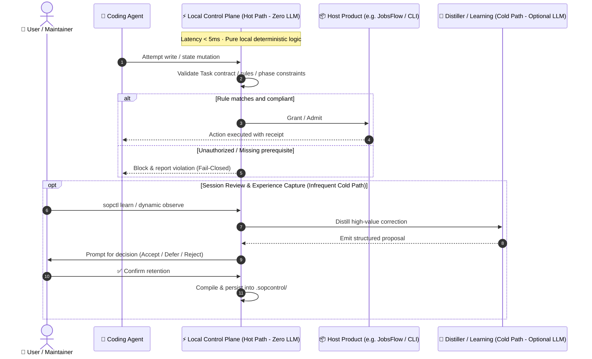

| Path | LLM? | Notes |
| :--- | :--- | :--- |
| `gate` / `doctor` / `audit` / rule selection / conflict & dominated-cost checks | **No** | Local pure functions or local I/O |
| Hooks / harness interception / capability tickets | **No** | Local control plane |
| `sopctl log *` | **No** | Explicitly zero-LLM |
| Dynamic observation & default proposal distillation | **No** | `DeterministicRuleExtractor` is rule/signal based; it is not an LLM |
| Optional Distiller Adapter (learning cold path) | **Optional, not wired by default** | At most one call per learning window; may only emit **proposals**; cannot write the registry, forge user confirmation, or admit the current action. The in-repo true-model slot is `UnprovenLLMAdapter` (explicitly unwired) |
| `repair` semantic repair | **Indirect** | The spine does not embed an LLM; an external harness CLI (e.g. OpenCode) may run repair while SOP Control constrains scope and receipts |
| Host products (e.g. JobsFlow) writing resumes / scoring JDs / chatting | **Host’s choice** | Those are host business model calls; SOP Control only requires formal entrances and that required checks affect the next step |

So: installing SOP Control does **not** add a model round-trip to every tool call. The model calls you see day to day usually come from **Cursor / Claude / Codex / JobsFlow themselves**, not from the control-plane hot path.

---

## 1. The problem it solves

A cooperating model often fails not because it cannot work, but because it reopens a decision that should already be settled:

- a decision lives only in chat and is reinterpreted in a new session or by a new model;
- an agent treats a product rule as a suggestion and changes an entrance, order, write boundary, or completion condition;
- a small preference expressed during work is valuable for the long term but lands in neither product documentation nor the control system;
- an expensive broad operation runs before the agent discovers that most of the work was unnecessary;
- a tool reports completion without passing a required product check or reaching the controlled entrance;
- every host product needs another prompt-and-adapter solution for every model.

SOP Control separates two spaces:

| Space | Owner | What may happen |
| :--- | :--- | :--- |
| **Rule space** | The project, product, and user | Decide what cannot be silently reopened, what must be checked, and what variation is allowed |
| **Solution space** | The agent and host product | Choose the implementation, order, and expression inside the boundary |

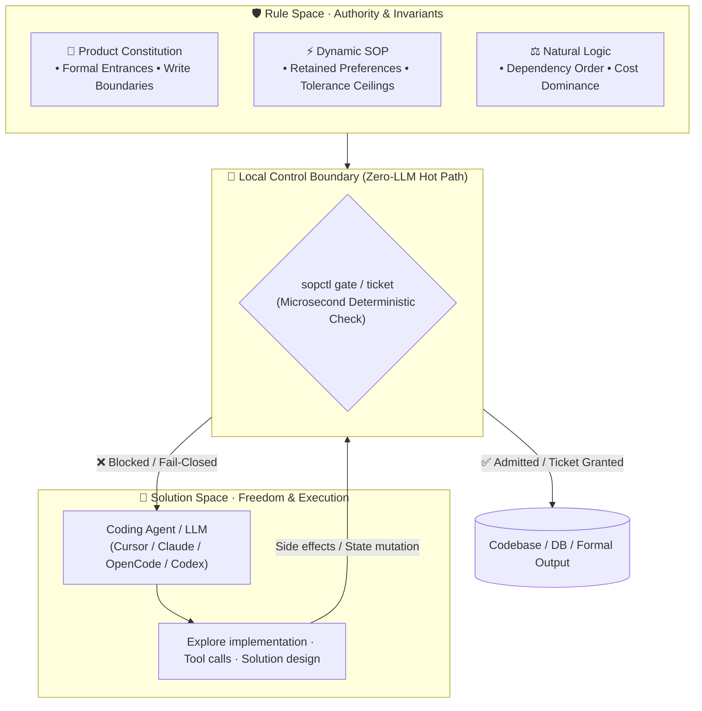

> **Autonomy belongs in solution space, not rule space.**

The purpose is not to make agents rigid. It is to separate “follow the settled rule” from “choose how to solve the task under that rule.”

### Pain points → how we address them

| What you run into | What usually happens without a control plane | What SOP Control does |
| :--- | :--- | :--- |
| **A new session or model reopens last week’s agreement** | The agreement lived only in chat and becomes a suggestion again | Persist it in `.sopcontrol/`, project it into agent context; mid-task `rebind` only tightens permissions |
| **You said “only these files / only the formal entrance,” but the agent still touches elsewhere** | Prompt-only limits; damage is noticed after the write | Task `allowed_writes` plus hooks / harness / gate intercept at the action boundary |
| **You corrected something in passing and wanted it to stick; next time it’s gone** | The correction stayed in one conversation | Dynamic observe / `learn` create proposals; they become permanent **only after your confirmation** |
| **A one-time exception becomes a forever rule — or a long-term preference is treated as chitchat** | No clear once_only vs permanent split | `once_only` never enters the permanent registry; long-term keep requires explicit confirmation |
| **The agent does expensive work on a huge set, then discovers most of it was unnecessary** | Dominated plans waste calls and time | Natural logic prefers filter-then-expensive defaults; explicit reverse intent is recorded as a task exception |
| **A tool says “done,” but required product checks never ran — or it was only a self-report** | Declarations are treated as success | Activity logs separate verified / observed / declared / unproven; gate-allow ≠ tool completed |
| **Every model and host needs another prompt-and-adapter stack** | Rules scatter and break when you change tools | One project control plane with harness adapters; hosts like JobsFlow can vendor a pinned snapshot |
| **You installed many “agent” tools and still can’t tell if rules actually fired** | Prompts, orchestration, and traces each cover a slice | `sopctl gate` / `log report` / coverage report which entrances were governed vs still a gap |
| **You’re afraid the control plane will add an LLM round-trip (and cost) to every step** | A second reviewer agent, or stuffing every check into the prompt | **Hot path adds zero extra LLM calls by default**; review / Distiller stay optional cold paths |
| **You need an OS sandbox or an engine that judges business correctness for you** | Expecting the control plane to be EDR, moderation, or a domain semantic judge | Out of Beta scope: we own rule boundaries and proof; business semantics and hostile-process defense are not promised |

---

## 2. Three peer, long-lived rule systems

The complete rule space has three peer types. They are different sources of durable product rules, not a hierarchy of hard, soft, and temporary rules.

| Rule type | Records | Typical source | Runtime role |
| :--- | :--- | :--- | :--- |
| **Product constitution** | Project facts, boundaries, entrances, state machine, delivery conditions, and non-negotiable decisions | Product design, architecture, code, confirmed decisions | Fix how the product is supposed to run |
| **Dynamic SOP** | Fine-grained requirements stated during work that the user wants to retain, including the permitted flexibility | Corrections, retrospectives, explicit learning | Fix how this experience should influence future runs |
| **Natural logic** | The most natural, least wasteful, least repetitive default order that still meets the goal | Goals, dependencies, cost, and preconditions | Prevent clearly dominated execution paths |

### 2.1 Product constitution

Constitution rules are the project’s growing product law:

- formal entrances and forbidden bypasses;
- product-owned write paths;
- state prerequisites;
- required checks whose results must affect the next action;
- the difference between completed, observed, and self-declared work.

They are normally written by a product owner or maintainer and connected to real consumers, hooks, harnesses, CI, or gates. The authoritative source is .sopcontrol/; AGENTS.md and CLAUDE.md are projections for agents, not competing policy stores.

### 2.2 Dynamic SOP

Dynamic SOP covers an important long-term case:

> The user did not pre-write a detail into the constitution, but clearly expressed a standard during real work that should continue to apply.

For example: “An independent audit checks JD fit, obvious factual errors, and the requested LLMO; it must not expand into a general-purpose critique or repeatedly rewrite a reasonable, explainable exaggeration.”

A dynamic SOP needs to express:

- trigger and applicable task or action;
- what must be checked and what is explicitly out of scope;
- the solution freedom left to the model;
- lower and upper bounds of allowed variation;
- repair strategy, maximum rounds, and stopping conditions;
- what is a one-time exception and what should persist.

Dynamic means that the rule is formed from practice and can have a scoped activation. It does not mean that the rule silently expires. Once retained, it is a peer of constitution rules in the permanent rule space. Inactivity, restart, model changes, software upgrades, and context-window boundaries do not delete it. Only explicitly one-time task constraints, tickets, and runtime evidence are expirable objects.

### 2.3 Natural logic

Natural logic asks, by default:

> When the user did not specify a reverse purpose, what path does the least useless work while still meeting the goal and respecting prerequisites?

For JobsFlow, the natural plan is:

1. filter by date and role;
2. exclude rows already tracked;
3. score only the remainder;
4. display or write the result.

Scoring everything before filtering is normally dominated waste. SOP Control can identify that from goals, operator contracts, dependencies, and local cost checks. If the user explicitly requests the reverse experiment, the system records a task exception and executes it; it does not “correct” the user back to the default.

---

## 3. How rules enter the control system

SOP Control does not turn every conversation into a rule, and it does not force users to author every rule manually. It offers parallel entry paths with a clear separation between discovery, proposal, and authority.

### 3.1 Product constitution: explicit authoring

For a settled product decision:

~~~bash
sopctl rule add --id RULE-001 \
  --statement "Data mutations must go through unified preview_gate" \
  --modality MUST --status proposed \
  --source-ref README.md --consumer-marker preview_gate

sopctl rule accept RULE-001 .
sopctl project all .
~~~

A rule may originate in product docs, architecture, or verified code behavior. A model’s guess that something “should be a rule” is not authority. After authoring, a real consumer or test must show that the rule is wired rather than merely present in the registry.

### 3.2 Ambient observation: automatic dynamic candidates

Conversation and runtime events may be observed with low disturbance:

1. collect corrections, repeated emphasis, clear post-error directions, and task context;
2. run local deduplication, scope isolation, and low-value filters;
3. create a candidate only;
4. notify the user briefly when the candidate is stable, consequential, and worth retaining.

Automatic recognition exists so valuable experience is not forgotten, not so the system silently decides permanent policy. Greetings, tracebacks, one-off experiments, and model self-justification should not become rules because a keyword appeared.

### 3.3 Explicit learn: inspired by Antigravity

Antigravity’s /learn is a useful product idea: a user can explicitly ask the agent to review the current context and distill reusable rules or skills. SOP Control incorporates that entry into the control plane, but it does not equate it with directly editing the host’s AGENTS.md:

~~~bash
sopctl learn review . --task-id <task-id>
sopctl learn list .
sopctl learn show <proposal-id> .
sopctl learn decide <proposal-id> --decision control .
~~~

The chain is:

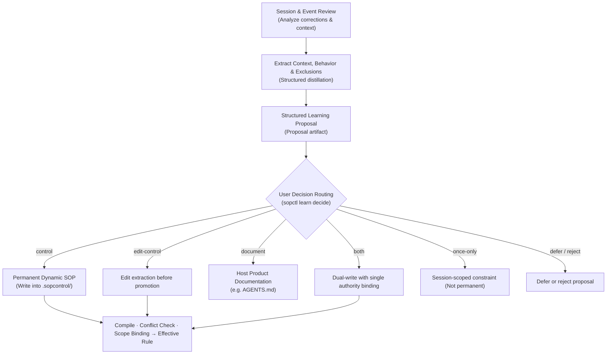

Routes mean:

- control: add a dynamic SOP to .sopcontrol/ as permanent authority;
- edit-control: edit the extracted result before promotion;
- document: write to the host product’s documentation, such as AGENTS.md;
- both: retain both with an explicit source relationship, never two independent authorities;
- once-only: keep it for the current task or session, never the permanent registry;
- defer / reject: retain the review outcome without changing effective rules.

A model may summarize and propose, but model output, candidates, logs, and “the model says the user confirmed” are not authorization. Permanent rules require real user confirmation, compilation, and runtime wiring.

The intended experience is therefore parallel:

- default ambient observation with only a short prompt when needed;
- explicit learn when the user wants to capture an experience;
- host-owned AGENTS.md remains available for product documentation;
- only content deliberately routed to the control plane gains cross-session and cross-model control effect.

### 3.4 Task-scoped constraints

Task contracts, run parameters, and one-time tickets describe how to do this task. They may tighten the current task but must not masquerade as permanent product law. If an experience should last, promote it through Dynamic SOP or learn.

### 3.5 Natural logic: generated by default, explicitly overridable

Natural logic normally does not need a rule authored for every ordinary order. The host supplies the goal, operation dependencies, processed-set information, cost, and allowed exceptions; SOP Control can generate or validate a default plan.

It applies only without an explicit reverse intent. If the user says “score everything first this time,” that is a task exception, not a new unbreakable business law.

---

## 4. The complete candidate-to-rule loop

Whether a candidate comes from ambient observation or learn, it follows one authority chain:

```mermaid
stateDiagram-v2
    direction LR
    [*] --> Observation: Session Correction / Review
    Observation --> Proposal: Automated Candidate (No Authority)
    Proposal --> UserDecision: Explicit Confirmation (Accept/Edit/Reject)
    UserDecision --> Compilation: Classification / Scope Binding
    Compilation --> SemanticChecks: Conflict / Widening / Expiry Checks
    SemanticChecks --> Projection: Project to Agent Context
    Projection --> RuntimeGate: Intercept at Action Boundary (Gate/Harness/Hook)
    RuntimeGate --> AuditEvidence: Activity Log & Ledger Verification
    AuditEvidence --> [*]
```

A durable dynamic rule must answer:

- when it applies;
- which product, task, action, and object it covers;
- its objective;
- what must happen;
- what is explicitly out of scope;
- what flexibility the model has;
- whether to stop, repair once, ask, or continue beyond the allowed range;
- how the runtime connection is proven.

Presence in the registry is not the same as control. Effective status needs compilation, projection, consumer or test evidence, and a report that distinguishes verified, observed, declared, and unknown activity.

---

## 5. Runtime control: low ceremony, not no control

The efficiency goal is to keep deterministic work local and reserve model calls for semantic cold paths.

| Path | Default behavior |
| :--- | :--- |
| Rule selection, scope matching, state machine, conflict, and dominated-cost checks | Local deterministic hot path, no LLM call |
| Read-only queries and previews | Pass through the gate without a mechanical ticket by default |
| Writes, publication, external submission, and other side effects | Use the product’s formal entrance and risk-based admit / ticket / receipt |
| Several actions in one phase | Prefer one phase grant instead of a ticket per step |
| Experience distillation and dynamic rule extraction | Infrequent cold path; an optional model only proposes |
| Required host semantic checks | Ensure the check is called, its result is consumed, and it affects the next action; do not replace the host’s business judgment |

Tickets, ledgers, hashes, and logs are for explainable admission on high-impact paths, not for turning every ordinary action into approval. Logs are visibility, not a second policy system: they cannot admit actions or promote permanent rules.

---

## 6. Integration: one connection, durable coverage

Another central theme is integration: install once, avoid asking users to rewrite every host entry, and avoid a fight between the control plane and the host product.

### 6.1 What first attach does

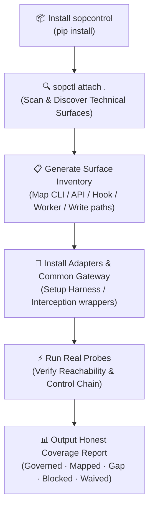

attach reads bounded structural metadata and entrance references to build an inventory. It does not feed the entire product into a model or rewrite business logic without confirmation. Safe surfaces receive adapters, projections, and probes; unsupported surfaces are reported as gaps or blocked, never silently counted as covered.

“One-time integration” does not mean every product is magically zero-change. A host needs identifiable, wrappable, or adaptable formal entrances. If all behavior is hidden in unobservable bypasses, the control plane cannot invent a control point. The product goal is one install/attach/verify interface for the user, with adapter work concentrated in the SOP Control contract and a thin host gateway.

### 6.2 Control success and coverage

Installation is not proof of effect. A host should count:

- discovered: an entrance was found;
- mapped: it maps to a control action;
- probed: a real probe reached it;
- governed: runtime actually passed through gate / harness / hook;
- waived: explicitly exempt with a reason;
- blocked / gap: control cannot be proven or a gap was found;
- unknown: host evidence is insufficient.

For a workflow product, units may be scan, filter, score, write, render, and apply. For a non-workflow product, use enumerable commands, APIs, workers, and side-effect entrances. Compute control success only over evidence-backed eligible units. If the denominator is unknown, display unknown or partial rather than a false 100%.

### 6.3 Upgrade and rollback

A host embeds a version snapshot. Updating SOP Control does not magically mutate a copy vendored into another repository. The intended experience is one host update path:

~~~bash
sopctl sync .
sopctl rollback .
~~~

The process should bind versions, check compatibility, preserve dynamic SOPs, compute semantic diffs, shadow-verify, switch atomically, and roll back on failure. A host such as JobsFlow pins the snapshot through a vendor pin, manifest, or dependency version; the host update path fetches and verifies the new SOP Control. If rules are lost, scope is widened, or an adapter breaks, the old runtime remains active.

---

## 7. Activity logs: make invisible control inspectable

Because SOP Control is infrastructure rather than a highly visual product, it needs compact, safe runtime logs that explain its actual effect. Logs should answer:

- which task and action ran;
- which rules were selected;
- which entrance and gate were used;
- whether a ticket was needed and redeemed;
- whether the host really started, finished, and returned;
- whether required semantic checks ran and their results were consumed;
- which units were governed, observed, declared, or unknown;
- which experiences became learning candidates.

~~~bash
sopctl log list .
sopctl log show . --run-id <run-id>
sopctl log report . --run-id <run-id> --format markdown
sopctl log health .
sopctl log benchmark .
~~~

Logs live under .sopcontrol-local/, are not the permanent rule source, and must not contain ticket secrets or full prompts. Reports should distinguish:

- verified: trusted runtime evidence;
- observed: observed event without sufficient execution proof;
- declared: caller self-report;
- unknown: cannot determine.

Logs can feed a later learning window, but cannot approve a dynamic SOP or turn a failure report into success.

---

## 8. Embedded host example: JobsFlow

[JobsFlow](https://github.com/mixxmax/jobsflow) embeds SOP Control so scan, push, materials, apply, and learn share one control plane and gateway.

| Concern | JobsFlow owns | SOP Control owns |
| :--- | :--- | :--- |
| JD retrieval, material generation, facts, and business semantics | Implementation and judgment | Does not replace it |
| Whether JD-fit, factual, and LLMO checks are required | Defines the checks | Ensures the entrances are called and results affect next actions |
| Filter, exclude tracked rows, then score | Supplies domain objects and phases | Constrains the default plan and blocks obvious dominated waste |
| Which actions may write or submit | Provides formal write entrances | Prevents bypassing them |
| Dynamic SOP and explicit learn | Supplies domain context | Manages candidates, confirmation, permanence, activation, and evidence |
| Upgrade | Updates vendor pin / manifest | Checks compatibility, retention, and rollback |

For example, “find paralegal jobs from the last week and show scores not yet entered” naturally means filter, exclude, then score. An explicit reverse experiment can override that default, but it remains a visible task exception.

JobsFlow remains responsible for business results. SOP Control ensures that JobsFlow’s designed entrances, order, required checks, and states are real control boundaries for agents.

---

## 9. What users experience

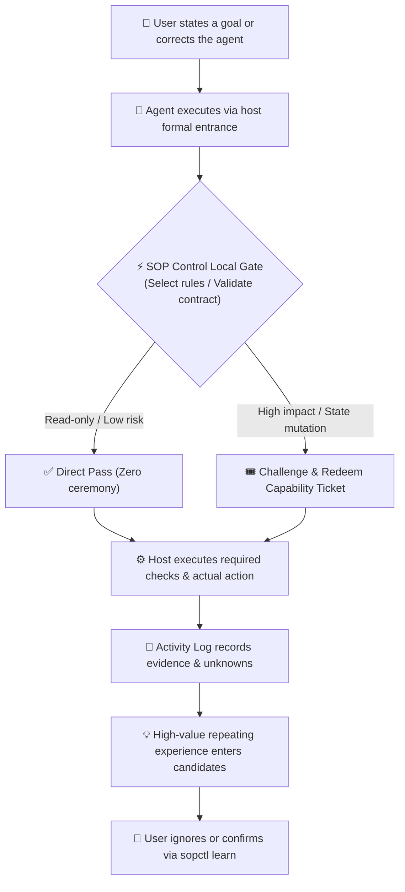

The intended daily experience is not a modal at every step:

1. the user speaks normally while the system observes in the background;
2. ordinary low-risk paths do not incur extra tickets or approvals;
3. rule conflicts, missing prerequisites, and unproven entrances produce a concrete next action;
4. once a long-lived rule is confirmed, a new session or model does not reopen it;
5. logs and coverage make actual control inspectable;
6. learn is available when the user wants to actively capture an experience.

---

## 10. Quickstart

### A. Run the minimal example

~~~bash
git clone https://github.com/mixxmax/sopcontrol.git && cd sopcontrol
git checkout v0.4.0
python3 -m venv .venv && source .venv/bin/activate
pip install -e ".[dev]"
sopctl gate examples/minimal
~~~

### B. Attach an existing product

~~~bash
pip install "git+https://github.com/mixxmax/sopcontrol.git@v0.4.0"
cd /path/to/your-app

sopctl attach .
sopctl attach-status .
sopctl compat .
sopctl doctor .
sopctl gate .
~~~

### C. Add a constitution rule

~~~bash
sopctl rule add --id RULE-001 \
  --statement "Data mutations must go through unified preview_gate" \
  --modality MUST --status proposed \
  --source-ref README.md --consumer-marker preview_gate
sopctl rule accept RULE-001 .
sopctl project all .
~~~

### D. Observe or explicitly learn a dynamic SOP

~~~bash
sopctl dynamic observe --quote "Independent audits only check JD fit and factual errors" \
  --source-ref "session-42" --action materials.audit
sopctl dynamic list

sopctl learn review . --task-id <task-id>
sopctl learn show <proposal-id> .
sopctl learn decide <proposal-id> --decision control .
~~~

### E. Inspect control and upgrade state

~~~bash
sopctl log report . --format markdown
sopctl sync .
sopctl rollback .
~~~

---

## 11. Supported execution surfaces

| Surface | Integration | Current note |
| :--- | :--- | :--- |
| **OpenCode** | Runtime plugin interception | Live-verified evidence exists |
| **Codex** | Projection, wrap / enter | Depends on host entrances and real probes |
| **Cursor** | Discovery marker only, no dedicated implementation | UNPROVEN, not listed as supported |
| **Claude Code** | PreToolUse protocol adapter | Adapted; verify in the target host |

These surfaces are different entrances to one project control plane, not competing rule sources. Switching a model or harness must not silently widen permissions.

---

## 12. Core commands

<b>📋 Click to expand / collapse: Full CLI Command Reference (sopctl)</b>

 

| Command | Role |
| :--- | :--- |
| `sopctl attach .` | First or mid-project integration and surface discovery |
| `sopctl attach-status .` | Inspect integration status |
| `sopctl doctor .` | Health check and next moves |
| `sopctl audit .` | Check whether MUST rules have real consumers |
| `sopctl gate .` | Final local or CI gate |
| `sopctl rule ...` | Product constitution lifecycle |
| `sopctl task ...` | Task contracts, submit, verify, deliver, and tightening model rebind |
| `sopctl dynamic ...` | Observe and confirm dynamic SOPs |
| `sopctl learn ...` | Explicit learning review, proposal, and routing |
| `sopctl log ...` | Activity logs, reports, health, and benchmark |
| `sopctl growth measure/diff` | Rule-space and ambiguity snapshots |
| `sopctl sync . / rollback .` | Controlled upgrade and rollback |

---

## 13. Boundaries and honest claims

SOP Control does not:

- guarantee that a model never makes a business mistake;
- replace the host’s facts, semantic engine, tests, code review, or product ownership;
- turn every ordinary action into an approval or ticket ceremony;
- auto-promote chat noise, tracebacks, repeated logs, or model self-reports into permanent rules;
- treat actor=user, a second agent CLI call, or a log line as real user confirmation;
- treat gate allow as proof that the host action completed;
- promise protection from a malicious peer process with equal filesystem rights;
- turn host documentation outside .sopcontrol/ into control-plane authority;
- promise complete coverage for a product with no formal, observable entrances;
- claim a cloud policy console, SSO, multi-tenant administration, or cross-platform production compliance in Beta;
- hide the fact that Python 3.10+ is required, macOS arm64 is the primary verified host, and other platforms need their own evidence.

Release readiness must be judged with real host integration, coverage, upgrade, and failure-path evidence—not test count alone. See [LIMITATIONS.md](LIMITATIONS.md), [RESIDUAL_RISKS.md](RESIDUAL_RISKS.md), and [PUBLISH.md](PUBLISH.md).

---

## 14. Documentation and development

- [DESIGN.md](DESIGN.md) — architecture, vocabulary, and invariants
- [PLAYBOOK.md](PLAYBOOK.md) — daily operating path
- [LIMITATIONS.md](LIMITATIONS.md) — Beta boundaries
- [RESIDUAL_RISKS.md](RESIDUAL_RISKS.md) — known bypass families
- [PUBLISH.md](PUBLISH.md) — release checklist
- [CHANGELOG.md](CHANGELOG.md) — release changes
- [ROADMAP.md](ROADMAP.md) — roadmap and progress
- [README_ZH-CN.md](README_ZH-CN.md) — standalone Chinese edition

~~~bash
git clone https://github.com/mixxmax/sopcontrol.git && cd sopcontrol
python3 -m venv .venv && source .venv/bin/activate
pip install -e ".[dev]"
pytest -q
sopctl project check .
sopctl gate corpus/fixtures/healthy-billing
~~~

## License

Distributed under the [MIT License](LICENSE).
